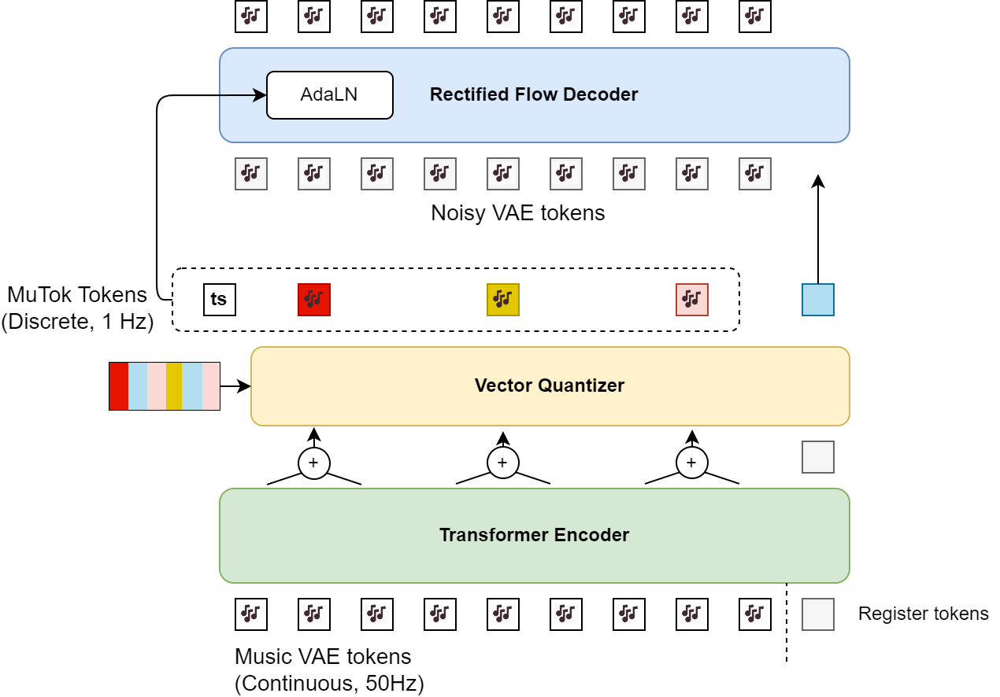

# MuTok
Assignment 2 for CSE253R @ ucsd 
~~"A piece of music is worth 1 token per second"~~
A drum track generator using flow matching.

Run training
```
export CUDA_VISIBLE_DEVICES=6
python main.py --config ./configs/drum_rf.yaml
```


